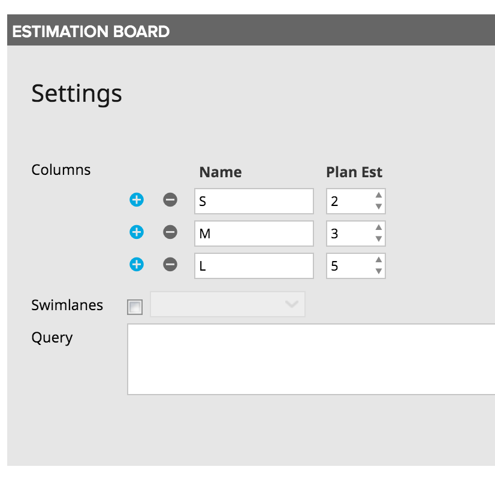

# EstimationBoard
New and Improved SDK2 based Estimation Board. This custom app is an update to the built-in [App Catalog Estimation Board] (https://help.rallydev.com/estimation-board). 

## Background
Agile estimation emphasizes relative sizing over trying to estimate absolute effort or durration. [Find out how and why] (https://help.rallydev.com/sizing-and-estimates).

Because we want to emphasize relative sizing, the estimation board is extremely useful for team sizing meetings. It encourages the team to visually compare the stories they are sizing by placing them into columns with like-sized stories. What is important is that the story is similar to those in its column. 

## Features
This board replicates all of the existing functionality, as well as providing several new and updated features. 

#### New Card Model
The updated board features the modern, highly interactive card model. Specifically, mouse over a card to:
- Add tasks, discussion posts, etc.
- Gear menu to copy, edit, split
- Mark stories ready or blocked
- Change card color

#### Pick the Fields Displayed
Use the "Show on Card" editor to decide which fields you wish to display on the cards. 

#### Dynamic Filtering
Use the standard "Filter" UI to filter which stories appear on the board. For example, if you wish to only size stories that belong to a particular feature, you can easily set Feature = "F123". You can also quick-filter by owner using the dropdown. 

#### Swimlanes
You can optionally display swimlanes on the board (horizontal groupings). See Settings below. 

## Installation and Settings
The app is installed as a Custom HTML App ([see help documentation](https://help.rallydev.com/custom-html))

Once the app is installed, used the gear menu on the app panel and select "Edit App Settings". There are 3 settings you can configure. 

#### Sizes
Enter the story-point sizes that you want to appear on the board. For example, "1,2,3,5,8".

#### Swim Lanes
If you want cards grouped in horizontal lanes by some criteria, click the checkbox to turn on swimlanes. This will activate the dropdown box so that you can select the field that will be used to create the groupings. For example, you could group stories by Portfolio Item (Feature) if you had several features you were breaking down and wanted to size all of the stories for each of the features in succession.

#### Query
In addition to the UI Filter control, you can write your own complex filter queries. [Extensive documentation] (https://help.rallydev.com/grid-queries?basehost=https://rally1.rallydev.com) is available. This might be useful if you want to always limit the board to certain criteria. 
